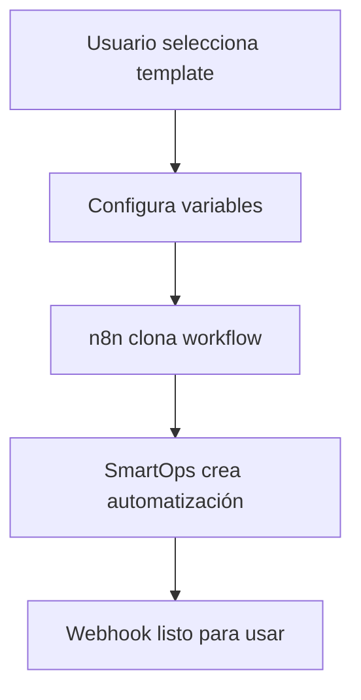

# 🤖 Sistema de Templates SmartOps

El sistema de templates de SmartOps permite crear flujos de automatización avanzados con IA de manera rápida y escalable. Cada template es un workflow pre-construido en n8n que puede ser clonado y personalizado para cada cliente.

## 📋 Tipos de Templates

### 1. **Templates Básicos** 
- FAQ simple sin IA
- Respuestas automáticas predefinidas
- Ideal para comenzar

### 2. **Templates con IA Avanzada**
- Agentes inteligentes con GPT-4/Claude
- Contexto de conversación persistente
- Análisis de intenciones automático
- Escalación inteligente

### 3. **Templates Especializados**
- E-commerce con recomendaciones
- Soporte técnico automatizado
- Agendamiento de citas inteligente
- Generación de leads avanzada

## 🚀 Cómo Funciona

### **Flujo de Creación**



### **Arquitectura del Sistema**

```
📱 WhatsApp/Telegram/Instagram
                ↓
🔗 Webhook n8n (Template clonado)
                ↓
🤖 Procesamiento IA (GPT-4/Claude)
                ↓
💾 SmartOps API (Contexto y Analytics)
                ↓
📊 Dashboard SmartOps (Métricas)
```

## 📚 Templates Disponibles

### 🏢 **Agente de Ventas con IA**
**Categoría:** `ai-agent` | **Dificultad:** `advanced`

**Funcionalidades:**
- ✅ Calificación automática de leads
- ✅ Recomendaciones de productos personalizadas
- ✅ Agendamiento de demos automático
- ✅ Scoring de leads en tiempo real
- ✅ Integración CRM automática

**Variables requeridas:**
- `CLIENT_NAME`: Nombre de la empresa
- `COMPANY_INFO`: Información de la empresa
- `PRODUCTS_INFO`: Catálogo de productos
- `OPENAI_API_KEY`: Clave API de OpenAI

**Ejemplo de uso:**
```javascript
// Clonar template
POST /api/automation/templates/TEMPLATE_ID/clone
{
  "name": "Bot Ventas Mi Empresa",
  "clientConfig": {
    "businessHours": {
      "enabled": true,
      "monday": { "start": "09:00", "end": "18:00" }
    }
  },
  "aiConfig": {
    "model": "gpt-4",
    "temperature": 0.7
  },
  "variables": {
    "CLIENT_NAME": "Mi Empresa S.A.",
    "COMPANY_INFO": "Empresa líder en tecnología...",
    "PRODUCTS_INFO": "1. Software CRM - $99/mes\n2. Consultoría - $150/hora"
  }
}
```

---

### 🛠️ **Soporte Técnico con IA**
**Categoría:** `support` | **Dificultad:** `advanced`

**Funcionalidades:**
- ✅ Resolución automática de problemas comunes
- ✅ Troubleshooting paso a paso
- ✅ Análisis de sentimientos del usuario
- ✅ Escalación inteligente a humanos
- ✅ Creación automática de tickets

**Variables requeridas:**
- `KNOWLEDGE_BASE`: Base de conocimiento FAQ
- `ESCALATION_EMAIL`: Email para escalaciones
- `OPENAI_API_KEY`: Clave API de OpenAI

---

### 📅 **Asistente de Citas con IA**
**Categoría:** `appointment` | **Dificultad:** `intermediate`

**Funcionalidades:**
- ✅ Verificación de disponibilidad en tiempo real
- ✅ Sugerencias inteligentes de horarios
- ✅ Confirmación automática de datos
- ✅ Recordatorios automáticos
- ✅ Integración con Google Calendar

**Variables requeridas:**
- `SERVICES`: Lista de servicios disponibles
- `APPOINTMENT_DURATION`: Duración promedio en minutos
- `CALENDAR_API_KEY`: API key del calendario

---

### 🛒 **Agente E-commerce con IA**
**Categoría:** `ecommerce` | **Dificultad:** `advanced`

**Funcionalidades:**
- ✅ Recomendaciones personalizadas de productos
- ✅ Procesamiento de órdenes automático
- ✅ Upselling y cross-selling inteligente
- ✅ Gestión de inventario en tiempo real
- ✅ Integración con métodos de pago

**Variables requeridas:**
- `PRODUCTS_CATALOG`: Catálogo completo de productos
- `PAYMENT_METHODS`: Métodos de pago aceptados
- `SHIPPING_POLICIES`: Políticas de envío

---

### ❓ **FAQ Básico**
**Categoría:** `basic` | **Dificultad:** `basic`

**Funcionalidades:**
- ✅ Respuestas automáticas predefinidas
- ✅ Búsqueda por palabras clave
- ✅ Multi-plataforma
- ✅ Sin IA (rápido y económico)

**Variables requeridas:**
- `FAQ_RESPONSES`: Preguntas y respuestas
- `FALLBACK_MESSAGE`: Mensaje cuando no entiende

## 🔧 Configuración de Variables

Cada template tiene variables que se pueden personalizar:

### **Tipos de Variables:**
- `text`: Texto simple
- `textarea`: Texto largo (descripciones, listas)
- `number`: Números (duración, precios)
- `boolean`: Verdadero/Falso
- `select`: Lista de opciones predefinidas

### **Variables Especiales:**
- `{{CLIENT_NAME}}`: Se reemplaza automáticamente
- `{{BUSINESS_HOURS}}`: Horarios de atención
- `{{COMPANY_INFO}}`: Información de la empresa
- `{{SMARTOPS_API_URL}}`: URL de la API SmartOps

## 📊 Métricas y Analytics

Cada template clonado genera métricas automáticas:

### **Métricas Básicas:**
- Total de mensajes procesados
- Tasa de respuesta exitosa
- Tiempo promedio de respuesta
- Usuarios únicos atendidos

### **Métricas Avanzadas (con IA):**
- Leads generados y scoring
- Intenciones detectadas
- Análisis de sentimientos
- Escalaciones a humanos
- Citas agendadas exitosamente

## 🛡️ Configuración de Seguridad

### **API Keys requeridas:**
```env
# n8n
N8N_BASE_URL=https://tu-n8n.railway.app
N8N_API_KEY=tu_api_key_n8n

# OpenAI (para templates con IA)
OPENAI_API_KEY=sk-tu_api_key_openai

# Claude (alternativa)
CLAUDE_API_KEY=tu_api_key_claude

# SmartOps
SMARTOPS_API_TOKEN=tu_token_smartops
```

### **Aislamiento por Tenant:**
- Cada cliente tiene workflows completamente separados
- Los webhooks incluyen el `tenantId` en la URL
- Las métricas se almacenan por tenant

## 🔄 Flujo de Clonación Detallado

### **1. Selección de Template**
```javascript
GET /api/automation/templates
// Retorna lista de templates disponibles con preview
```

### **2. Configuración de Variables**
```javascript
GET /api/automation/templates/TEMPLATE_ID
// Retorna template específico con variables requeridas
```

### **3. Clonación**
```javascript
POST /api/automation/templates/TEMPLATE_ID/clone
{
  "name": "Mi Bot Personalizado",
  "clientConfig": { ... },
  "aiConfig": { ... },
  "variables": { ... }
}
```

### **4. Resultado**
```javascript
{
  "success": true,
  "data": {
    "automation": { ... },
    "workflowId": "n8n_workflow_id",
    "webhookUrl": "https://n8n.com/webhook/tenant123-chatbot"
  }
}
```

## 🎯 Casos de Uso Reales

### **Restaurante:**
- Template: "Agente de Ventas IA"
- Función: Tomar pedidos, recomendar platos, procesar delivery
- Plataformas: WhatsApp, Instagram
- Variables: Menú, horarios, zona de delivery

### **Consultorio Médico:**
- Template: "Asistente de Citas IA"
- Función: Agendar citas, recordatorios, pre-consulta
- Plataformas: WhatsApp, Telegram
- Variables: Doctores, horarios, servicios

### **Tienda Online:**
- Template: "Agente E-commerce IA"
- Función: Recomendar productos, procesar órdenes, soporte
- Plataformas: WhatsApp, Instagram, Facebook
- Variables: Catálogo, precios, métodos de pago

### **Software Company:**
- Template: "Soporte Técnico IA"
- Función: Resolver bugs, documentación, escalación
- Plataformas: Webchat, Telegram
- Variables: Knowledge base, equipo de soporte

## 📈 Escalabilidad

### **Templates Simples:**
- Pueden manejar 1000+ mensajes/día
- Latencia < 100ms
- Costo mínimo (sin IA)

### **Templates con IA:**
- Pueden manejar 500+ mensajes/día
- Latencia 1-3 segundos
- Costo variable según modelo de IA

### **Optimizaciones:**
- Cache de respuestas frecuentes
- Rate limiting por usuario
- Fallback a respuestas simples en horarios pico

## 🔧 Desarrollo de Templates Personalizados

Si necesitas un template específico, puedes:

1. **Crear workflow en n8n manualmente**
2. **Registrarlo como template en MongoDB**
3. **Definir variables configurables**
4. **Testear el proceso de clonación**

```javascript
// Ejemplo de template personalizado
const customTemplate = new Template({
  name: "Mi Template Personalizado",
  description: "Template específico para mi industria",
  category: "custom",
  n8nWorkflowId: "workflow_id_from_n8n",
  variables: [
    {
      name: "CUSTOM_VAR",
      label: "Variable personalizada",
      type: "text",
      required: true
    }
  ]
});
```

## 🆘 Soporte y Troubleshooting

### **Problemas Comunes:**

**Error: "Template no encontrado"**
- Verificar que el template esté activo: `isActive: true`
- Verificar que sea público: `isPublic: true`

**Error: "Clonación fallida"**
- Verificar conexión con n8n
- Verificar API keys de IA
- Revisar variables requeridas

**Performance lento:**
- Verificar latencia de n8n
- Optimizar prompts de IA
- Implementar cache

### **Logs y Monitoreo:**
```javascript
// Ver logs de template
GET /api/automation/templates/TEMPLATE_ID/logs

// Ver métricas de workflow clonado
GET /api/automation/AUTOMATION_ID/stats
```

---

¡Con este sistema de templates, puedes crear automatizaciones sofisticadas en minutos en lugar de semanas! 🚀 